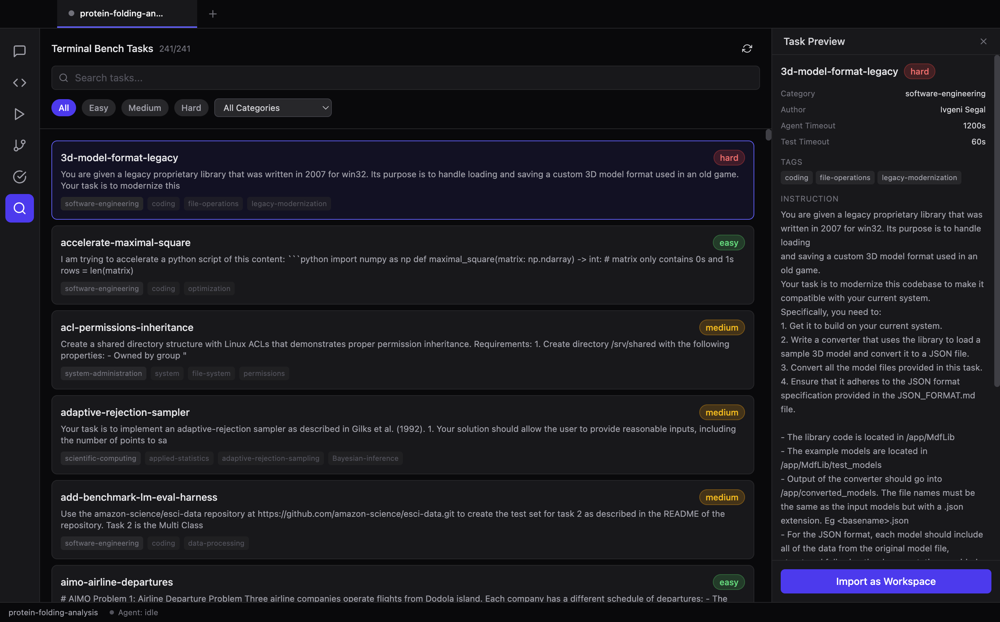
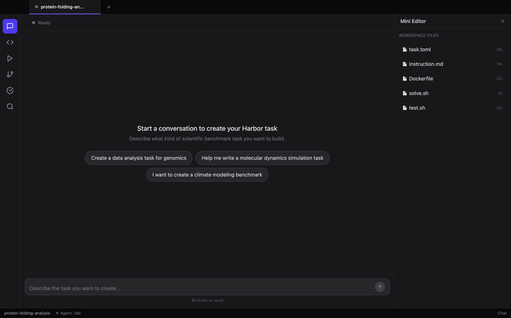
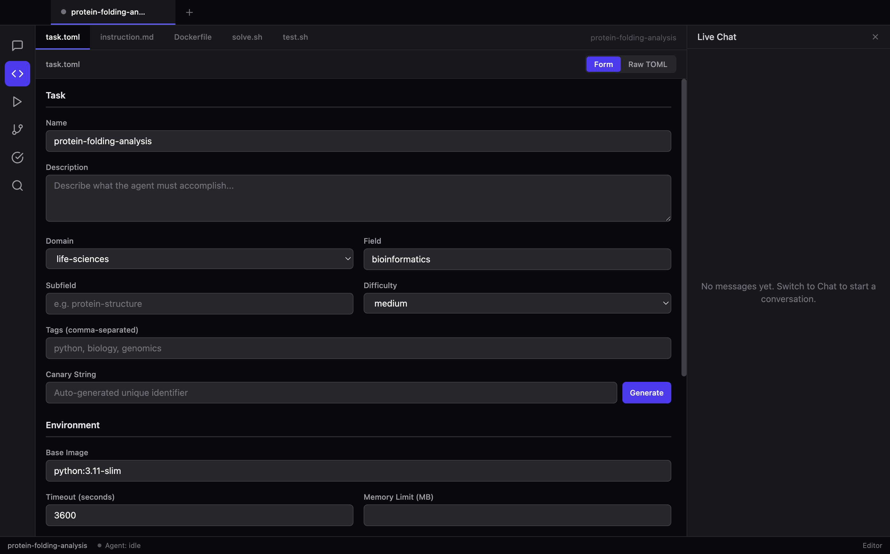
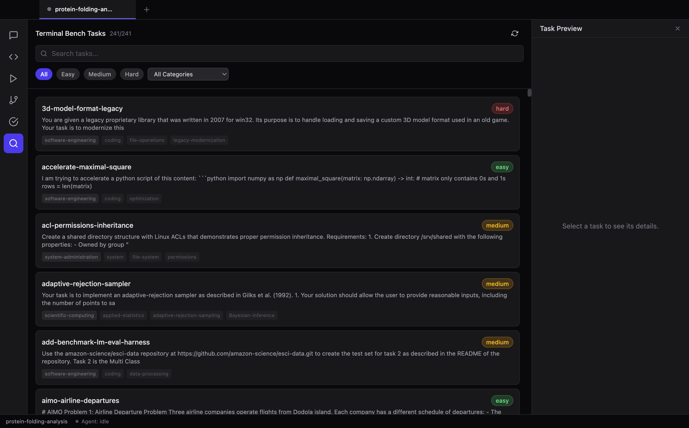
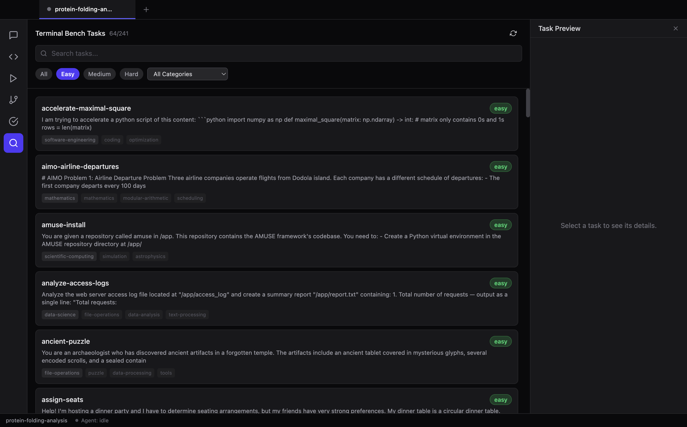
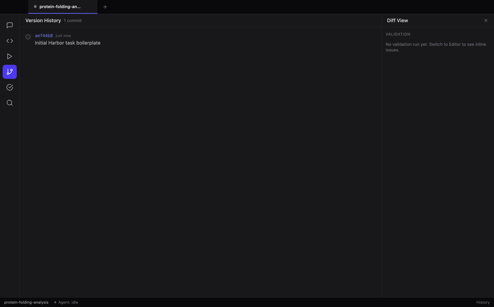

# Terminal Bench Task Generator

A desktop application for creating, browsing, and managing [Terminal-Bench-Science](https://github.com/laude-institute/terminal-bench) benchmark tasks in the [Harbor](https://github.com/harbor-ai/harbor) format. Scientists chat with an AI agent (Claude Code CLI) to iteratively generate and refine task files, then validate and test them locally.



## Features

### Chat-Driven Task Authoring
Describe the benchmark task you want to create in natural language. A Claude Code agent generates and iterates on all five Harbor files (`task.toml`, `instruction.md`, `Dockerfile`, `solve.sh`, `test.sh`) in real time, with tool-call visibility and streaming responses.



### Visual Task Editor
Edit Harbor files with a tabbed Monaco editor. The `task.toml` file has both a structured form view (shown below) and a raw TOML editor. A live chat sidebar keeps the agent conversation accessible while editing.



### Terminal Bench Browser
Discover and import any of the 241 existing tasks from the `laude-institute/terminal-bench` repository. Search by name or keyword, filter by difficulty and category, preview full task details, and import with one click. Imported tasks are automatically converted from the repo's `task.yaml` format to Harbor's `task.toml` format.



**Task preview with metadata, instruction, and file list:**


**Filter by difficulty:**



### Version History
Every agent turn and manual save auto-commits via isomorphic-git. Browse the full commit history, view file-level diffs, and restore any previous version.



### Additional Features
- **Workspace Tabs** — Work on multiple tasks simultaneously
- **Harbor Validation** — Real-time validation of task files against the Harbor schema
- **Critique & Scoring** — AI-powered critique across multiple quality dimensions
- **Docker Runner** — Verify solutions and run agent trials locally (planned)

## Architecture

```
┌─────────────────────────────────────────────────────────────┐
│  Renderer (React + Tailwind + Zustand)                      │
│  ┌──────────┬───────────┬──────────┬─────────┬───────────┐  │
│  │ChatPanel │EditorPanel│RunnerPanel│BrowsePanel│HistoryPanel│
│  └──────────┴───────────┴──────────┴─────────┴───────────┘  │
│  ┌──────────────────────────────────────────────────────────┐│
│  │  Zustand stores: ui, workspace, chat, editor, browse     ││
│  └──────────────────────────────────────────────────────────┘│
├──────────────── IPC (contextBridge) ─────────────────────────┤
│  Main Process (Node.js)                                      │
│  ┌───────────┬────────────┬──────────┬────────────────────┐  │
│  │AgentService│WorkspaceService│GitService│BrowseService      │
│  │(claude CLI)│(CRUD + files) │(isomorphic│(GitHub API +     │
│  │            │               │ -git)     │ YAML→TOML)       │
│  └───────────┴────────────┴──────────┴────────────────────┘  │
│  ┌──────────────────────────────────────────────────────────┐│
│  │  DatabaseService (JSON file), chokidar file watcher       ││
│  └──────────────────────────────────────────────────────────┘│
└─────────────────────────────────────────────────────────────┘
```

**Key technologies:** Electron + electron-vite, React 19, TypeScript, Tailwind CSS v4, Zustand + Immer, Monaco Editor, isomorphic-git, Claude Code CLI (subprocess)

## Getting Started

### Prerequisites
- **Node.js** >= 18
- **npm** (or pnpm)
- **Claude Code CLI** — installed and authenticated (`claude` must be on PATH)

### Install & Run

```bash
git clone https://github.com/yipihey/TerminalBenchTaskGenerator.git
cd TerminalBenchTaskGenerator
npm install
npm run dev
```

This launches the Electron app with hot-reload for the renderer.

### Build for Production

```bash
npm run build
```

Output is written to `out/`. Run the packaged app with:

```bash
npx electron out/main/index.js
```

### Type Check

```bash
npm run typecheck
```

### Run E2E Tests

```bash
node test-e2e.mjs     # 20 UI + API tests
node test-browse.mjs   # 35 browse-feature tests
```

## Project Structure

```
src/
├── main/                     # Electron main process
│   ├── index.ts              # Window creation, IPC registration
│   ├── ipc/                  # IPC handlers (one file per domain)
│   │   ├── workspace.ipc.ts
│   │   ├── agent.ipc.ts
│   │   ├── browse.ipc.ts
│   │   ├── git.ipc.ts
│   │   ├── filesystem.ipc.ts
│   │   ├── validation.ipc.ts
│   │   ├── critique.ipc.ts
│   │   └── ...
│   ├── services/             # Business logic
│   │   ├── WorkspaceService.ts
│   │   ├── AgentService.ts
│   │   ├── BrowseService.ts
│   │   ├── GitService.ts
│   │   ├── DatabaseService.ts
│   │   └── ...
│   └── utils/
│       └── paths.ts
├── preload/                  # Electron context bridge
│   ├── api.ts                # ElectronAPI type definitions
│   └── index.ts              # contextBridge exposure
├── renderer/                 # React UI
│   ├── components/
│   │   ├── layout/           # AppShell, Sidebar, WorkspaceTabs
│   │   ├── chat/             # ChatPanel, ChatMessage, AgentStatus
│   │   ├── editor/           # EditorPanel, MonacoEditor, TaskTomlEditor
│   │   ├── browse/           # BrowsePanel, TaskCard, TaskPreview
│   │   ├── history/          # VersionHistory
│   │   ├── critique/         # CritiquePanel
│   │   ├── runner/           # RunnerPanel
│   │   └── shared/           # Button, Panel, Badge, Dialog
│   ├── stores/               # Zustand + Immer state
│   │   ├── uiStore.ts
│   │   ├── workspaceStore.ts
│   │   ├── chatStore.ts
│   │   ├── editorStore.ts
│   │   └── browseStore.ts
│   └── hooks/                # Custom React hooks
│       ├── useWorkspace.ts
│       ├── useAgent.ts
│       └── useBrowse.ts
└── shared/
    └── types.ts              # All TypeScript interfaces
```

## How It Works

### Task Authoring Flow

1. **Create a workspace** — generates boilerplate Harbor files
2. **Chat with the agent** — describe your task; Claude Code edits the files in-place via tool calls
3. **Review in the editor** — inspect and manually refine the generated files
4. **Validate** — check the task against Harbor schema rules
5. **Critique** — get AI-powered quality scores and suggestions
6. **Test** — run the solution and verification scripts in Docker

### Browse & Import Flow

1. **Click Browse** (magnifying glass icon) in the sidebar
2. The app fetches the full task index from GitHub (cached for 1 hour)
3. **Search** by name, instruction text, or tags
4. **Filter** by difficulty (easy/medium/hard) or category
5. **Click a task** to preview its full details in the right panel
6. **Click "Import as Workspace"** — downloads all files and converts:
   - `task.yaml` → `task.toml` (Harbor format)
   - `instruction` field → `instruction.md`
   - `solution.sh` → `solve.sh`
   - `run-tests.sh` → `test.sh` (wrapped with Harbor reward output)
   - All other files copied as-is

## Harbor File Format

Each workspace produces five standard files:

| File | Purpose |
|------|---------|
| `task.toml` | Task metadata: name, domain, difficulty, timeouts, verifier config |
| `instruction.md` | Natural-language instructions given to the AI agent |
| `Dockerfile` | Container environment setup |
| `solve.sh` | Reference solution script |
| `test.sh` | Verification script (writes `0.0` or `1.0` to `/logs/verifier/reward.txt`) |

## License

MIT
